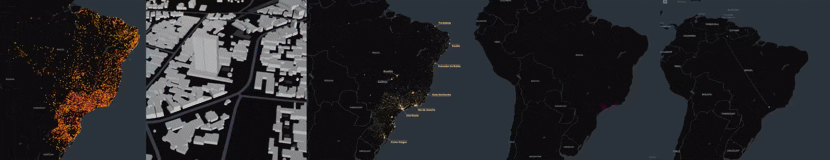
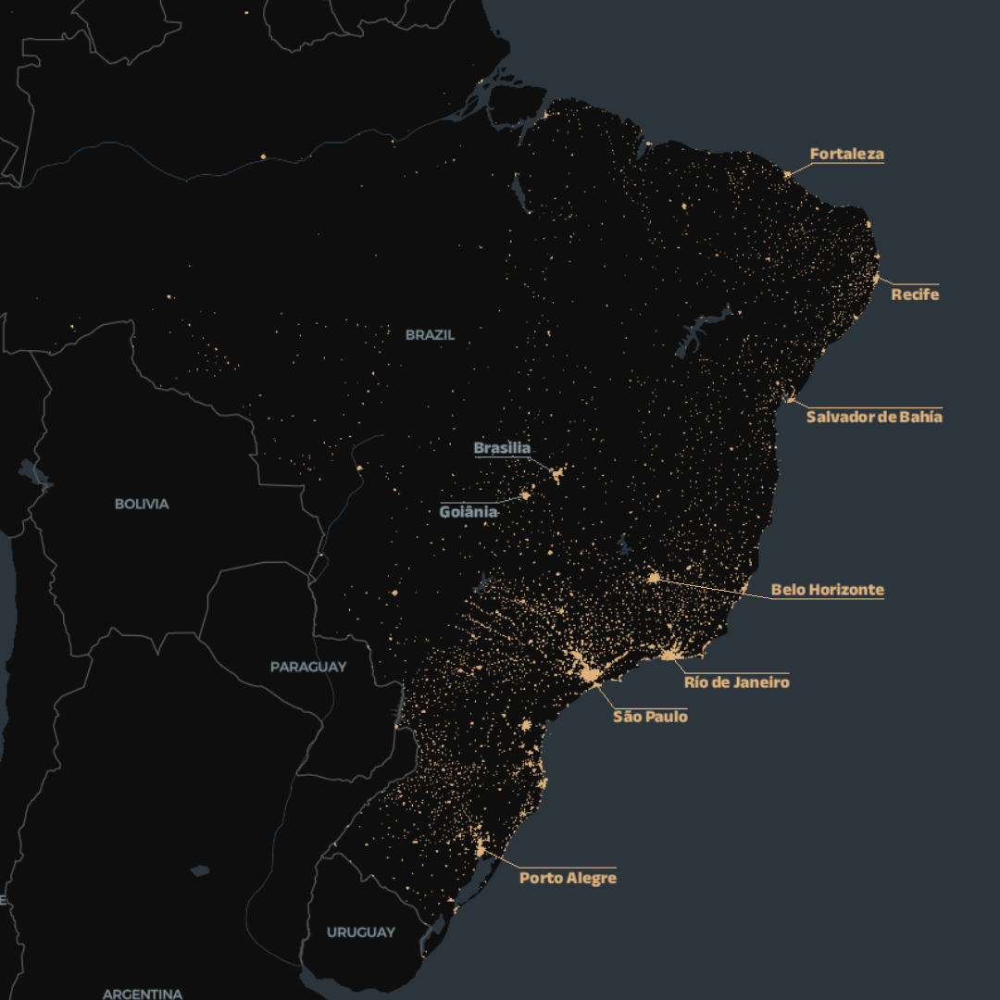
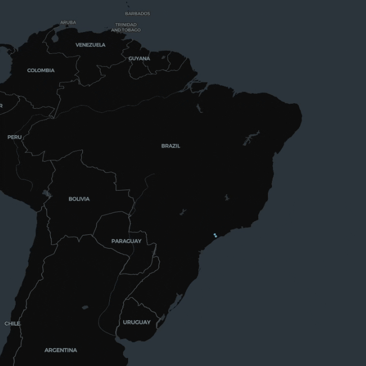
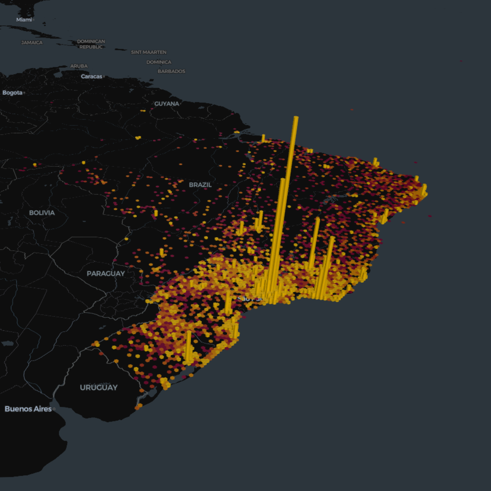
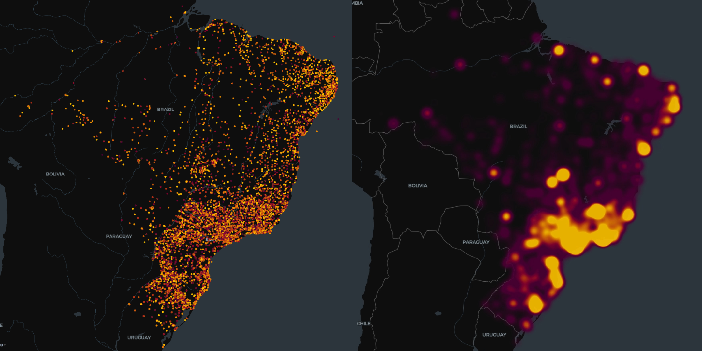

## Índice

* [Contexto](#contexto)
* [Recursos del Proyecto](#recursos-del-proyecto)
* [La Arquitectura de Datos](#la-arquitectura-de-datos)
* [La optimización de la tabla de Geoposición (-98% de tamaño)](#la-optimizacion-de-la-tabla-de-geoposicion--98-de-tamano)
* [Datos faltantes](#datos-faltantes)
* [Hallazgos y Análisis](#hallazgos-y-analisis)
* [Métricas Generales](#metricas-generales)
* [Comportamiento y Métodos de Pago](#comportamiento-y-metodos-de-pago)
* [Costo de envíos y retrasos](#costo-de-envios-y-retrasos)
* [Análisis Geoespacial](#analisis-geoespacial)
* [Nombres de zonas con gran volumen de compras](#nombres-de-zonas-con-gran-volumen-de-compras)
* [Ventas en el tiempo](#ventas-en-el-tiempo)
* [Dispersión del Valor de Compras](#dispersion-del-valor-de-compras)
* [Densidad de Clientes (Mapa de Calor)](#densidad-de-clientes-mapa-de-calor)
* [Diccionario](#diccionario)

---

<a id="contexto"></a>

# Contexto

Este conjunto de datos fue proporcionado por Olist. Contiene información de 100 000 pedidos realizados entre 2016 y 2018 en diversos marketplaces de Brasil. Se trata de datos comerciales reales que han sido anonimizados.

Tras la compra de un producto en Olist Store, el vendedor recibe una notificación para procesar el pedido. Una vez que el cliente recibe el producto, o cuando se acerca la fecha de entrega estimada, recibe por correo electrónico una encuesta de satisfacción donde puede expresar su opinión sobre la compra y añadir algunos comentarios.

---

<a id="recursos-del-proyecto"></a>

# Recursos del Proyecto

La base de datos que Olist proporcionó tiene nueve tablas en formato `.csv`:

### `customers_dataset`

| customer_id                      | customer_unique_id               | customer_zip_code_prefix | customer_city | customer_state |
| -------------------------------- | -------------------------------- | ------------------------ | ------------- | -------------- |
| 061a531d906f4bfb762be36757e41f7b | 3168dc37da92585ed2bf29058b0cc143 | 69911                    | rio branco    | AC             |
| 00012a2ce6f8dcda20d059ce98491703 | 248ffe10d632bebe4f7267f1f44844c9 | 6273                     | osasco        | SP             |
| ...                              | ...                              | ...                      | ...           | ...            |

### `geolocation_dataset`

| geolocation_zip_code_prefix | geolocation_lat    | geolocation_lng    | geolocation_city | geolocation_state |
| --------------------------- | ------------------ | ------------------ | ---------------- | ----------------- |
| 1037                        | -23.54562128115268 | -46.63929204800168 | sao paulo        | SP                |
| 1046                        | -23.54608112703553 | -46.64482029837157 | sao paulo        | SP                |
| ...                         | ...                | ...                | ...              | ...               |

### `order_items_dataset`

| order_id                          | order_item_id | product_id                       | seller_id                        | shipping_limit_date | price | freight_value |
| --------------------------------- | ------------- | -------------------------------- | -------------------------------- | ------------------- | ----- | ------------- |
| 00010242fe8c5a6d1ba2dd792cb16214  | 1             | 4244733e06e7ecb4970a6e2683c13e61 | 48436dade18ac8b2bce089ec2a041202 | 2017-09-19 09:45:35 | 58.9  | 13.29         |
| 000229ec398224ef6ca0657da4fc703e0 | 1             | c777355d18b72b67abbeef9df44fd0fd | 5b51032eddd242adc84c38acab88f23d | 2018-01-18 14:48:30 | 199   | 17.87         |
| ...                               | ...           | ...                              | ...                              | ...                 | ...   | ...           |

### `order_payments_dataset`

| order_id                         | payment_sequential | payment_type | payment_installments | payment_value |
| -------------------------------- | ------------------ | ------------ | -------------------- | ------------- |
| b81ef226f3fe1789b1e8b2acac839d17 | 1                  | credit_card  | 8                    | 99.33         |
| a9810da82917af2d9aefd1278f1dcfa0 | 1                  | credit_card  | 1                    | 24.39         |
| ...                              | ...                | ...          | ...                  | ...           |

### `order_reviews_dataset`

| review_id                        | order_id                         | review_score | review_comment_title | review_comment_message     | review_creation_date | review_answer_timestamp |
| -------------------------------- | -------------------------------- | ------------ | -------------------- | -------------------------- | -------------------- | ----------------------- |
| 86c5cfa7fcbde303f704b60a78ced7d6 | a6456e781cb962cc3f412b04de4fed7b | 5            | Entrega perfeita     | Muito bom. muito cheiroso. | 2018-06-13 00:00:00  | 2018-06-14 17:29:03     |
| 7bc2406110b926393aa56f80a40eba40 | 73fc7af87114b39712e6da79b0a377eb | 4            | NULL                 | NULL                       | 2018-01-18 00:00:00  | 2018-01-18 21:46:59     |
| ...                              | ...                              | ...          | ...                  | ...                        | ...                  | ...                     |

### `orders_dataset`

| order_id                         | customer_id                      | order_status | order_purchase_timestamp | order_approved_at   | order_delivered_carrier_date | order_delivered_customer_date | order_estimated_delivery_date |
| -------------------------------- | -------------------------------- | ------------ | ------------------------ | ------------------- | ---------------------------- | ----------------------------- | ----------------------------- |
| 00010242fe8c5a6d1ba2dd792cb16214 | 3ce436f183e68e07877b285a838db11a | delivered    | 2017-09-13 08:59:02      | 2017-09-13 09:45:35 | 2017-09-19 18:34:16          | 2017-09-20 23:43:48           | 2017-09-29 00:00:00           |
| 00018f77f2f0320c557190d7a144bdd3 | f6dd3ec061db4e3987629fe6b26e5cce | delivered    | 2017-04-26 10:53:06      | 2017-04-26 11:05:13 | 2017-05-04 14:35:00          | 2017-05-12 16:04:24           | 2017-05-15 00:00:00           |
| ...                              | ...                              | ...          | ...                      | ...                 | ...                          | ...                           | ...                           |

### `product_category_name_translation`

| product_category_name     | product_category_name_english |
| ------------------------- | ----------------------------- |
| agro_industria_e_comercio | agro_industry_and_commerce    |
| alimentos                 | food                          |
| ...                       | ...                           |

### `products_dataset`

| product_id                       | product_category_name | product_name_lenght | product_description_lenght | product_photos_qty | product_weight_g | product_length_cm | product_height_cm | product_width_cm |
| -------------------------------- | --------------------- | ------------------- | -------------------------- | ------------------ | ---------------- | ----------------- | ----------------- | ---------------- |
| 00066f42aeeb9f3007548bb9d3f33c38 | perfumaria            | 53                  | 596                        | 6                  | 300              | 20                | 16                | 16               |
| 00088930e925c41fd95ebfe695fd2655 | automotivo            | 56                  | 752                        | 4                  | 1225             | 55                | 10                | 26               |
| ...                              | ...                   | ...                 | ...                        | ...                | ...              | ...               | ...               | ...              |

### `sellers_dataset`

| seller_id                        | seller_zip_code_prefix | seller_city | seller_state |
| -------------------------------- | ---------------------- | ----------- | ------------ |
| 0015a82c2db000af6aaaf3ae2ecb0532 | 9080                   | santo andre | SP           |
| 001e6ad469a905060d959994f1b41e4f | 24754                  | sao goncalo | RJ           |
| ...                              | ...                    | ...         | ...          |

---

<a id="la-arquitectura-de-datos"></a>

# La Arquitectura de Datos

Antes de analizar los datos, debemos relacionar las tablas. Para saber qué tabla tiene el `order_id` como clave primaria, usamos este código. La tabla que devuelva cero no tiene IDs repetidos; si devuelve otro número, entonces tiene IDs repetidos.

### Código para saber qué relaciones hay

```sql
SELECT 
a.table_name AS tabla1,
a.column_name AS columna,
b.table_name AS tabla2
FROM information_schema.columns a
JOIN information_schema.columns b
	ON a.column_name = b.column_name
    AND a.table_name < b.table_name
WHERE a.table_schema = DATABASE()
	AND b.table_schema = DATABASE();
```

### Buscar las tablas primarias

```sql
SELECT
'order_items_dataset' AS tabla,
COUNT(order_id) - COUNT(DISTINCT(order_id)) AS Repetidos
FROM order_items_dataset

UNION ALL

SELECT
'order_payments_dataset' AS tabla,
COUNT(order_id) - COUNT(DISTINCT(order_id)) AS Repetidos
FROM order_payments_dataset

UNION ALL

SELECT
'order_reviews_dataset' AS tabla,
COUNT(order_id) - COUNT(DISTINCT(order_id)) AS Repetidos
FROM order_reviews_dataset

UNION ALL

SELECT
'orders_dataset' AS tabla,
COUNT(order_id) - COUNT(DISTINCT(order_id)) AS Repetidos
FROM orders_dataset;
```

Ya descubrimos que `orders_dataset` es la tabla primaria de `order_id`.

Hacemos lo mismo con las demás relaciones y estos son los resultados:

| Nombre de tabla                   | Nombre de columna     |
| --------------------------------- | --------------------- |
| orders_dataset                    | order_id              |
| customers_dataset                 | customer_id           |
| products_dataset                  | product_id            |
| sellers_dataset                   | seller_id             |
| product_category_name_translation | product_category_name |

Para no asumir que todas las columnas realmente están relacionadas y contienen lo mismo —y no son solo coincidencias de nombres—, hagamos una prueba rápida para comparar todas las columnas relacionadas:

```sql
SELECT
dat.order_id,
rev.order_id,
pay.order_id,
ite.order_id

FROM orders_dataset AS dat
JOIN order_reviews_dataset AS rev
	ON dat.order_id = rev.order_id
JOIN order_payments_dataset AS pay
	ON dat.order_id = pay.order_id
JOIN order_items_dataset AS ite
	ON dat.order_id = ite.order_id;
```

Ya que sabemos que los IDs son idénticos entre tablas, podemos crear las relaciones con:

```sql
ALTER TABLE customers_dataset 
	MODIFY COLUMN customer_id VARCHAR(50);

ALTER TABLE orders_dataset 
	MODIFY COLUMN order_id VARCHAR(50),
	MODIFY COLUMN customer_id VARCHAR(50);

ALTER TABLE order_items_dataset 
	MODIFY COLUMN order_id VARCHAR(50),
    MODIFY COLUMN product_id VARCHAR(50),
    MODIFY COLUMN seller_id VARCHAR(50);

ALTER TABLE order_payments_dataset 
	MODIFY COLUMN order_id VARCHAR(50);

ALTER TABLE order_reviews_dataset
	MODIFY COLUMN order_id VARCHAR(50);

ALTER TABLE sellers_dataset 
	MODIFY COLUMN seller_id VARCHAR(50);

ALTER TABLE products_dataset 
	MODIFY COLUMN product_id VARCHAR(50),
    MODIFY COLUMN product_category_name VARCHAR(50);

ALTER TABLE product_category_name_translation
	MODIFY COLUMN product_category_name VARCHAR(50);


ALTER TABLE orders_dataset ADD PRIMARY KEY(order_id);
ALTER TABLE customers_dataset ADD PRIMARY KEY(customer_id);
ALTER TABLE products_dataset ADD PRIMARY KEY(product_id);
ALTER TABLE sellers_dataset ADD PRIMARY KEY(seller_id);
ALTER TABLE product_category_name_translation ADD PRIMARY KEY(product_category_name);

ALTER TABLE order_items_dataset ADD CONSTRAINT
FOREIGN KEY (order_id) REFERENCES orders_dataset(order_id);

ALTER TABLE order_payments_dataset ADD CONSTRAINT
FOREIGN KEY (order_id) REFERENCES orders_dataset(order_id);

ALTER TABLE order_reviews_dataset ADD CONSTRAINT
FOREIGN KEY (order_id) REFERENCES orders_dataset(order_id);

ALTER TABLE orders_dataset ADD CONSTRAINT
FOREIGN KEY (customer_id) REFERENCES customers_dataset(customer_id);

ALTER TABLE order_items_dataset ADD CONSTRAINT
FOREIGN KEY (product_id) REFERENCES products_dataset(product_id);

ALTER TABLE order_items_dataset ADD CONSTRAINT
FOREIGN KEY (seller_id) REFERENCES sellers_dataset(seller_id);

ALTER TABLE products_dataset ADD CONSTRAINT
FOREIGN KEY (product_category_name) REFERENCES product_category_name_translation(product_category_name);
```

**Error 1452:** la tabla de productos contenía categorías huérfanas (`pc_gamer` y `portable_kitchen_food_preparers`) que no existían en `product_category_name_translation`. Se corrigió insertando estas categorías faltantes y, adicionalmente, se homogeneizaron los registros `NULL` bajo la etiqueta `unknown` para evitar campos vacíos.

```sql
INSERT INTO product_category_name_translation (
    product_category_name,
    product_category_name_english
)
VALUES 
    ('portateis_cozinha_e_preparadores_de_alimentos','portable_kitchen_food_preparers'),
    ('pc_gamer','pc_gamer');
```


---

<a id="la-optimizacion-de-la-tabla-de-geoposicion--98-de-tamano"></a>

# La optimización de la tabla de Geoposición (-98% de tamaño)

`geolocation_dataset` es un mapa de Brasil. Debería tener 1 000 163 códigos postales distintos, pero como los últimos 3 dígitos fueron anonimizados, por ejemplo:

`Antes = 94856-360 | Ahora = 94856`

Por eso no relacionamos `geolocation_dataset`.`geolocation_zip_code_prefix` con `customers_dataset`.`customer_zip_code_prefix`. Habría muchas latitudes y longitudes para un único cliente.

Como de 1 millón de filas solo coinciden aproximadamente 19 mil con los clientes, vamos a crear una nueva tabla con solo 19 mil filas, cada una con un código postal único. No vamos a borrar todas las repetidas; más bien, las combinaremos para tener una latitud y longitud promedio de todas ellas:

```sql
CREATE TABLE geolocation_clean_dataset AS
SELECT
	geolocation_zip_code_prefix AS zip_code,
    AVG(geolocation_lat) AS latitud,
    AVG(geolocation_lng) AS longitud,
    geolocation_city AS ciudad,
    geolocation_state AS estado
FROM geolocation_dataset
GROUP BY
	zip_code,
    ciudad,
    estado;
```

Creamos una nueva tabla para poder hacer un mapa, ya que el de Power BI está limitado a 3500 puntos. Así que usaremos como herramienta `kepler.gl`. Para crear la tabla usamos:

```sql
CREATE TABLE geo_rutas_arcos AS
SELECT 
    i.order_id,
    i.freight_value,
    i.price,
    o.order_purchase_timestamp AS fecha_compra,
    geo_sel.latitud AS seller_lat,
    geo_sel.longitud AS seller_lng,
    geo_cus.latitud AS cust_lat,
    geo_cus.longitud AS cust_lng
FROM order_items_dataset AS i
JOIN sellers_dataset AS s 
	ON i.seller_id = s.seller_id
JOIN geolocation_clean AS geo_sel 
	ON s.seller_zip_code_prefix = geo_sel.zip_code
JOIN orders_dataset AS o 
	ON i.order_id = o.order_id
JOIN customers_dataset AS c 
	ON o.customer_id = c.customer_id
JOIN geolocation_clean AS geo_cus 
	ON c.customer_zip_code_prefix = geo_cus.zip_code;
```

---

<a id="datos-faltantes"></a>

# Datos faltantes

| order_status | total_pedidos | tienen_aprobacion | tienen_correo | tienen_entrega_cliente |
| :--- | ---: | ---: | ---: | ---: |
| delivered | 96478 | 96464 | 96476 | 96470 |
| shipped | 1107 | 1107 | 1107 | 0 |
| canceled | 625 | 484 | 75 | 6 |
| unavailable | 609 | 609 | 0 | 0 |
| invoiced | 314 | 314 | 0 | 0 |
| processing | 301 | 301 | 0 | 0 |
| created | 5 | 0 | 0 | 0 |
| approved | 2 | 2 | 0 | 0 |


```sql
SELECT 
    order_status,
    COUNT(*) AS total_pedidos,
    COUNT(order_approved_at) AS tienen_aprobacion,
    COUNT(order_delivered_carrier_date) AS tienen_correo,
    COUNT(order_delivered_customer_date) AS tienen_entrega_cliente
FROM orders_dataset
GROUP BY order_status
ORDER BY total_pedidos DESC;
```

* 8 marcados como entregados no tienen fecha de entrega.

* 14 entregados no tenían aprobación.

* 2 entregados no aparecen como recibidos por el transportista.

* 1107 fueron enviados, pero no tienen fecha de entrega.

### De los cancelados(625):

* 484 fueron aprobados y 75 fueron recibidos por el transportista.
* 6 se cancelaron luego de ser entregados.
* 314 aprobaron el pago, pero quedaron procesando.

---

<a id="hallazgos-y-analisis"></a>

# Hallazgos y Análisis

<a id="metricas-generales"></a>

## Métricas Generales


**Concentración de mercado:** El estado de São Paulo domina con más del 37% del GMV. Al cruzar esto con la categoría top (Salud y Belleza), se sugiere priorizar el almacenamiento de los productos top en los centros de distribución de SP para asegurar tiempos de entrega cortos.

---

<a id="comportamiento-y-metodos-de-pago"></a>

## Comportamiento y Métodos de Pago


**Desplome en fines de semana:** El volumen de pedidos cae un 50% los domingos frente a los picos del martes. Se recomienda al equipo comercial evaluar incentivos de fin de semana.

3 de cada 4 compras se realizan con tarjeta de crédito. A mayor cantidad de cuotas, más caras son las compras.

---
## Evolución Temporal y Comparativa Interanual


Olist tuvo un gran crecimiento desde enero de 2017, con 130k a 1.11M en enero de 2018 (840%). En 2018 no tuvo un gran crecimiento, pero mantuvo un valor en compras estables mes a mes.

---

<a id="costo-de-envios-y-retrasos"></a>

## Costo de envíos y retrasos


Los estados del norte sufren en promedio mas días de retraso debido a la gran distancia de la capital, donde se encuentran la mayoría de los vendedores.

Recomendación: Recalibrar el algoritmo de estimación de tiempo de entrega para estas regiones remotas, ya que prometer fechas irreales afecta a las valoraciones del producto.

---

## Rendimiento de Vendedores, Calificacion y Atributos de Producto


Se observa un claro incremento entre productos vendidos y el largo del nombre de los productos, siendo en promedio un nombre de **60 caracteres** el que más ganancias genera.

Las descripciones que más venden suelen tener un tamaño entre 300 y 700 caracteres.

---

<a id="analisis-geoespacial"></a>

# Análisis Geoespacial

Diversos mapas para visualizar compradores, vendedores y envíos en el tiempo.

Puedes acceder a los enlaces de cada mapa para ir al mapa web.


<a id="nombres-de-zonas-con-gran-volumen-de-compras"></a>

## Nombres de zonas con gran volumen de compras




---

<a id="ventas-en-el-tiempo"></a>

## Ventas en el tiempo

El mapa muestra las ventas en orden cronológico, uniendo un arco entre el vendedor y el cliente. Se observa que, al inicio, las ventas empezaron en el Sur y, con el tiempo, se expandieron por todo el país.



[](https://mauricio-dipablo.github.io/Olist_Project-SQL-Power-Bi-kepler.gl/Visualizaciones/Mapas/Mapas_Webs/Ventas_en_el_Tiempo.html)

---

<a id="dispersion-del-valor-de-compras"></a>

## Dispersión del Valor de Compras

La altura de las barras representa el volumen en Reales (R$). Aquí validamos que, aunque hay clientes por todo el país, el verdadero flujo de dinero ocurre en un radio pequeño del sur.



[](https://mauricio-dipablo.github.io/Olist_Project-SQL-Power-Bi-kepler.gl/Visualizaciones/Mapas/Mapas_Webs/Valor_Compras.html)

---

<a id="densidad-de-clientes-mapa-de-calor"></a>

## Densidad de Clientes (Mapa de Calor)

Este mapa muestra la saturación del mercado en la costa de Brasil. Las zonas más brillantes (São Paulo y Río de Janeiro) son probablemente el centro de todos los e-commerce de Brasil.



[](https://mauricio-dipablo.github.io/Olist_Project-SQL-Power-Bi-kepler.gl/Visualizaciones/Mapas/Mapas_Webs/Customers.html)
[](https://mauricio-dipablo.github.io/Olist_Project-SQL-Power-Bi-kepler.gl/Visualizaciones/Mapas/Mapas_Webs/Mapa_Calor.html)

---

<a id="diccionario"></a>

# Diccionario

<a id="customers_dataset-1"></a>

### `customers_dataset`

**¿Por qué existe `customer_id` y `customer_unique_id`?**

Si contamos, vemos que hay:

| Columna              | Cantidad de IDs distintos |
| -------------------- | ------------------------: |
| `customer_id`        |                     99441 |
| `customer_unique_id` |                     96096 |
| **Diferencia**       |                  **3345** |

Sabemos que también hay 99441 `order_id`, o sea que hay un `customer_id` por cada `order_id`.

Entonces, `customer_id` es un segundo `order_id` del pedido, mientras que `customer_unique_id` es lo que identifica al usuario.

**¿Por qué no se guarda solo el código postal, en vez de guardar también la ciudad y el estado?**

Porque en Brasil hay ciudades con el mismo nombre. Por ejemplo:

| customer_city | customer_zip_code_prefix |
| ------------- | -----------------------: |
| alvorada      |                    77480 |
| alvorada      |                    94855 |

Son 2 ciudades con el mismo nombre y las diferenciamos con el código postal. Tendría sentido guardar solo el código postal si queremos reducir espacio.

Pero el problema llega al entregar el pedido:

La ley exige que la etiqueta impresa tenga explícitamente:

* Calle y número
* Ciudad completa
* Sigla del Estado (ej: SP)
* Código Postal (CEP)

Así que guardarlas es mejor que generarlas para cada paquete vendido.

Lo mismo pasa si quieres analizar los datos. Es mejor tener esas tres columnas guardadas que llamar 1 millón de filas (de `geolocation_dataset`) para cada consulta.

---

<a id="geolocation_dataset-1"></a>

### `geolocation_dataset`

**¿Por qué tiene más de 1 millón de filas?**

`geolocation_dataset` es un mapa de Brasil. Debería tener 1 000 163 códigos postales distintos, pero como los últimos 3 dígitos fueron anonimizados, por ejemplo:

`Antes = 94856-360 | Ahora = 94856`

Así que ahora el mapa tiene 19 015 códigos postales únicos.

Por eso no relacionamos `geolocation_dataset`.`geolocation_zip_code_prefix` con `customers_dataset`.`customer_zip_code_prefix`, habría muchas latitudes y longitudes para un único cliente.

Como de 1 millón de filas solo coinciden aproximadamente 19 mil con los clientes, vamos a crear una nueva tabla con solo 19 mil filas, cada una con un código postal único. No vamos a borrar todas las repetidas; más bien, las combinaremos para tener una latitud y longitud promedio de todas ellas:

```sql
CREATE TABLE geolocation_clean_dataset AS
SELECT
	geolocation_zip_code_prefix AS zip_code,
    AVG(geolocation_lat) AS latitud,
    AVG(geolocation_lng) AS longitud,
    geolocation_city AS ciudad,
    geolocation_state AS estado
FROM geolocation_dataset
GROUP BY
	zip_code,
    ciudad,
    estado;
```

---

<a id="order_items_dataset-1"></a>

### `order_items_dataset`

`order_item_id`: se usa para diferenciar los productos que hay en una sola compra. Si una persona compra 10 productos en un mismo carrito, los `order_item_id` irán del 1 al 10.

`order_items_dataset`: es el límite de tiempo que tiene el **vendedor** para entregar el pedido a la empresa de logística.

`freight_value`: es el costo del flete. Este se aplicaba a cada producto, no al carrito. Si comprabas 15 productos, se sumaban 15 costos de flete, aunque sean del mismo vendedor. Así, si devolvías uno, solo se reembolsaba ese producto.

Olist no ganaba dinero de los envíos, así que no nos interesa el coste para calcular las ganancias, pero sí para calcular la probabilidad de reembolso.

---

<a id="order_payments_dataset-1"></a>

### `order_payments_dataset`

`payment_sequential`: es un contador que aumenta con cada medio de pago que utilicé. Por ejemplo, esta compra se hizo con 29 cupones y, como fue en un solo pago, `payment_installments = 1`.

Se crea una fila por cada medio de pago.

| order_id  | payment_sequential | payment_type | payment_installments | payment_value |
| --------- | -----------------: | ------------ | -------------------: | ------------: |
| fa65da... |                 29 | voucher      |                    1 |         19.26 |
| fa65da... |                 28 | voucher      |                    1 |         29.05 |
| ...       |                ... | ...          |                  ... |           ... |

`payment_type`: existían varios medios de pago y se podían combinar entre ellos.

| payment_type |                    |
| ------------ | ------------------ |
| credit_card  | Tarjeta de crédito |
| boleto       | Boleto Bancário    |
| voucher      | Cupón              |
| debit_card   | Tarjeta de débito  |
| not_defined  | No definido        |

*boleto: Es un instrumento financiero regulado por el **Banco Central de Brasil** y emitido a través de una entidad bancaria (como Itaú, Bradesco, Banco do Brasil o pasarelas de pago asociadas a Olist). El dinero sale directamente del bolsillo del cliente (o de su cuenta) hacia la cuenta bancaria de la empresa a través del sistema financiero tradicional.*

---

<a id="order_reviews_dataset-1"></a>

### `order_reviews_dataset`

* `review_creation_date`: muestra la fecha en que se envió la encuesta de satisfacción al cliente.
* `review_answer_timestamp`: muestra la marca de tiempo de la respuesta a la encuesta de satisfacción.

---

<a id="orders_dataset-1"></a>

### `orders_dataset`

`order_status`:

|             |               |                                                                                 |
| ----------- | ------------- | ------------------------------------------------------------------------------- |
| processing  | procesando    | consultando al banco                                                            |
| invoiced    | facturado     | transacción realizada                                                           |
| approved    | aprobado      | pago aprobado                                                                   |
| created     | creado        |                                                                                 |
| shipped     | enviado       | el proceso de envío empezó                                                      |
| delivered   | entregado     | el cliente recibió el producto                                                  |
| canceled    | cancelado     | cancelado en cualquier parte del proceso                                        |
| unavailable | no disponible | el vendedor se dio cuenta de que no tenía stock luego de que el pago se realizó |

`order_purchase_timestamp`: fecha y hora de la compra.

`order_approved_at`: fecha y hora de aprobación del pago.

`order_delivered_carrier_date`: fecha y hora de cuándo se entregó al socio logístico.

`order_delivered_customer_date`: fecha y hora real de entrega del pedido al cliente.

`order_estimated_delivery_date`: fecha y hora de entrega estimada que se le comunicó al cliente en el momento de la compra.
